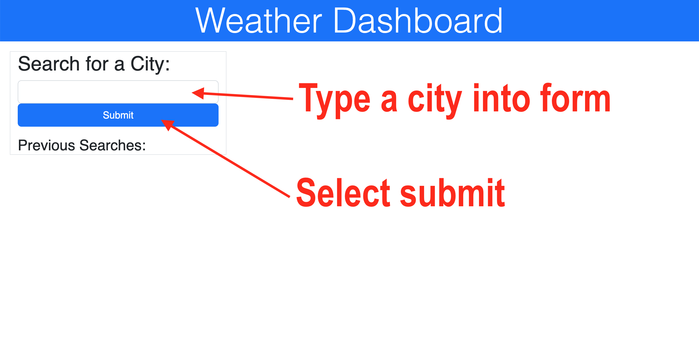
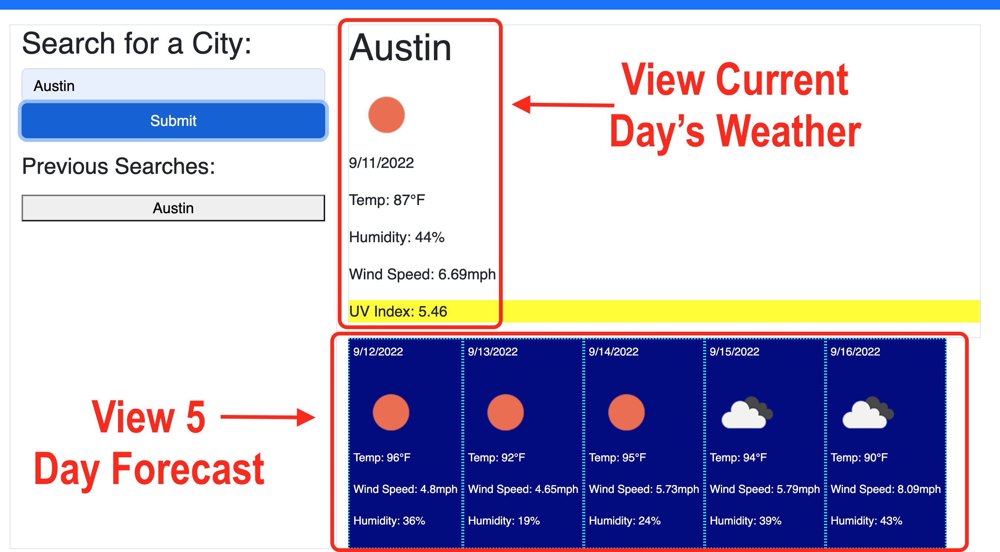
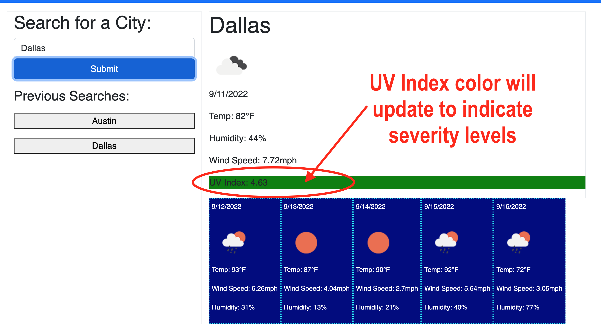
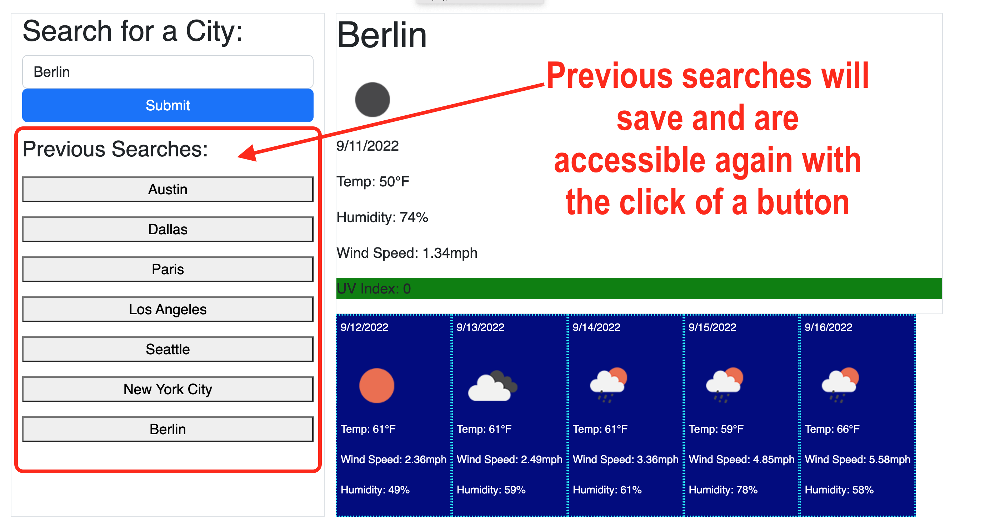

# **Weather Dashboard**

## Deployed Link
Click [here.](https://chelsea314.github.io/Challenge-6---Server-Side-APIs-Weather-Dashboard/)
## Description
The purpose of this applicaiton is to give travelers the weather forecast for cities of their choosing so that they can plan trips accordingly. Their searches are saved and accessible to review again.

## Table of Contents
 - [How it Works](#how-it-works)
 - [Resources](#resources)
 - [Contributing](#contributing)
 - [Questions](#questions)

##  How it Works:
When the user first arrives to the Weather Dashboard, they will be presented with a form to search for a city. 

Users will be able to view the current day's weather as well as the five day forecast for the city in which they searched. 

The color surrounding the UV Index for the current day's weather will change color based on the severity. 

Green indicates a low risk of harm from unprotected sun exposure, yellow indicates a moderate risk and red indicates a high risk. 

Users can also keep track of their previous searches and access them again by clicking the corresponding button.

 

## Resources
[Open Weather API](https://openweathermap.org/api/one-call-api) | [Bootstrap](https://www.npmjs.com/package/bootstrap) | [jQuery](https://jquery.com/)

## Contributing
<table>

<td align="center"><a href="https://github.com/chelsea314"> <b>Chelsea Sexton</b></a></td>

<td align="center"><a href="https://github.com/Jadentr44"> <b>Jaden Rodriguez</b></a></td>
</tr>
</table>

## Questions
Feel free to contact Chelsea with suggestions for improvements, questions or concerns.
 

[Email: Chelsea Sexton](mailto:chelseansexton@gmail.com)
